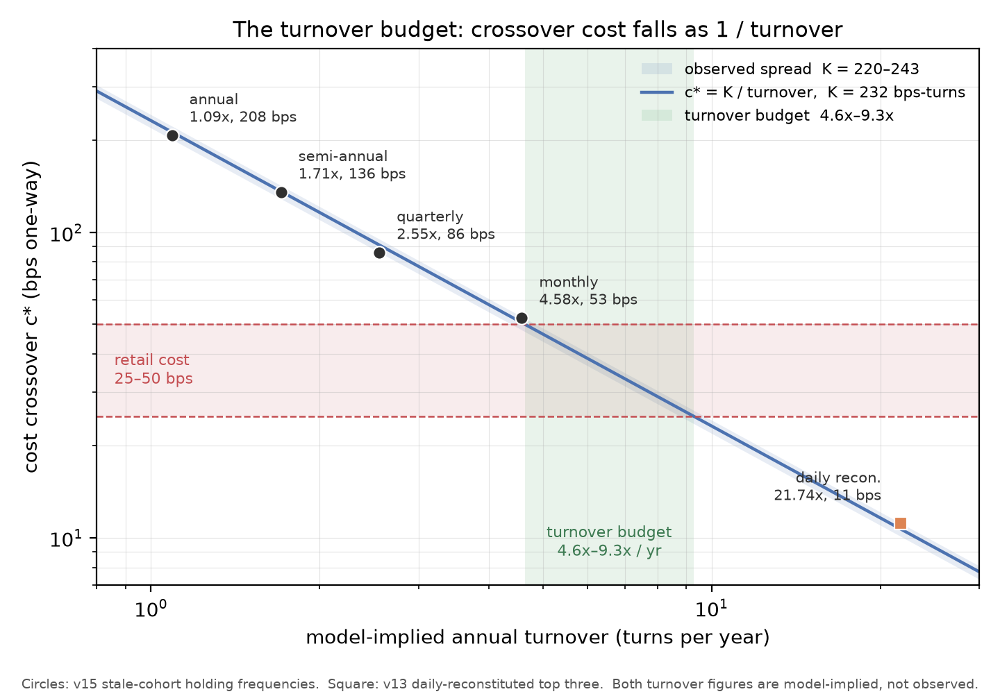

# Momentum Before 1980

**Seventeen studies, one reusable constraint, and a cross-sectional momentum
edge that does not survive the era a retail investor can trade.**

The Woodland Fund · 2026-09-10

> **Correction, 2026-09-26.** This report previously called the EODHD
> constituent panel "survivorship-free" and "point-in-time". Both overstate it
> (`2026-09-26-planning-correction-survivorship-claim-strength.md`).
> - **Prices** are delisting-inclusive, with 213 constituent symbols
>   (1,574 symbol-years) refused.
> - **Delisting returns** are bracketed at 0% and −100%.
> - **Membership** throughout 1999–2026 comes from the symbol-matched public
>   `fja05680/sp500` list, not a vendor point-in-time record.
>
> The affected passages are reworded below. No conclusion changes.

> **Status — closed and signed.** The research phase ended on 2026-09-10 under
> a pre-registered stopping rule
> (`2026-09-10-planning-decision-termination-signed.md`). The basis is not the
> overlay's failure — the risk-free recomputation changed v17 C1 to met and
> invalidated that trigger — but the era result, now established three times on
> unrelated data by different methods. Nothing was promoted. The turnover
> budget and the incumbent's tail advantage are unchanged.

---

## The question

Can a retail researcher, working with free daily data and no leverage, build a
systematic equity or ETF strategy that beats a boring balanced portfolio on a
risk-adjusted basis, out of sample, after costs?

The answer this programme reached is **no** — reached on a pre-registered
stopping rule rather than by exhaustion, and currently under correction. The
useful part was never the answer but the shape of it. Two research lines,
seventeen completed studies (sixteen of them pre-registered; the exception is
disclosed below), one of them withdrawn before execution and later revived on
constituent-level data, and 320 distinct configurations later, the interesting part is
that the two research lines failed for entirely different reasons — and that
collapsing them into one explanation was this programme's own longest-standing
mistake.

What the programme produced instead of a strategy is a **budget**. Trading has
a price, that price scales with how often you trade, and the two combine into a
single reusable constant: across every configuration whose turnover and
break-even cost are both on the record, their product sits near **232
bps-turns**. That fixes a ceiling on how often a retail book can afford to
trade — for this project, roughly **4.6× to 9.3× a year** — before the edge it
is chasing is spent on the chasing. The constant is the most transferable thing
here, and it is stated below in enough detail to be checked or refuted.

The three constraints that were open when this report was first drafted have
all since resolved, and none of them was cost. **Identification** — the
low-turnover results were model-implied — is closed: a constituent panel
with delisting-inclusive prices (membership from a symbol-matched public list)
was purchased, built and run, and it agreed with the model. The **measurement defect** in the programme's own Sharpe
convention was corrected, and the correction changed which study closed the
research phase. What remains is not an open constraint but the finding itself:
the **post-1980 null**. No momentum comparison in this programme survives the
modern era, and three independent readings now say so.

This report leads with the method rather than the results, because the method is
what makes the results worth anything. A negative result from an undisciplined
process is indistinguishable from incompetence. A negative result from a process
that pre-registers its hypotheses, counts its own trials, and measures the size
of its own tests is evidence.

Every headline number cited here regenerates from source under one command, and
every study is recorded in an append-only journal that was never edited after
the fact. Filenames are cited throughout so any claim can be checked against the
entry that produced it.

---

## The discipline

Six mechanisms did the work. None is novel; the discipline was applying all of
them at once, before looking at results, and leaving the record intact when they
produced answers we did not want. The sixth arrived last and should have come
first.

### Pre-registration

Every study fixed its universe, its searched parameters, its selection rule, and
its reporting format in a dated journal entry **written before the study ran**.
Pre-registration entries state what would count as success and what would count
as failure. Several also record an explicit expectation, so that neither outcome
could be reframed afterwards as the one we predicted — `trend-v5` recorded in
advance that a null was the likely result
(`2026-09-01-trend-v5-riskweight-preregistration.md`), and `trend-v9` recorded
in advance which part of its question was genuinely uncertain
(`2026-09-02-trend-v9-leverage-preregistration.md`).

The journal is append-only. When a result was later read too favourably, the
correction was a **new entry standing beside the original**, not an edit:
`2026-09-02-trend-v8-correction-1.md` reclassifies the v8 blending result as a
negative one and binds how it may be cited in future.

### The trials ledger

Every configuration evaluated is written to a SQLite ledger — winners, losers,
abandoned runs, and configurations that errored. The current count is **301
distinct configurations across 9,450 fold-level rows**.

The ledger exists because a Sharpe ratio is a maximum taken over however many
things you tried, and the maximum of N zero-skill draws is comfortably positive.
Reported deflated Sharpe ratios use the ledger's count, not a recollection. In
practice the deflation was usually *vacuous* — most studies ran a single
pre-registered configuration with no selection, so there was no selection bias to
correct — and every entry says so rather than quoting a reassuring number it
had not earned.

### Block bootstrap and HAC, and measuring the tests themselves

Before this programme had error bars, every comparison it made was a point
estimate. `woodland/stats.py` added two independent routes to a Sharpe
difference: the Politis–Romano stationary block bootstrap (geometric block
starts, expected block length fixed at 21 bars, chosen before any real series
was touched) and the Ledoit–Wolf HAC delta-method counterpart with an
Andrews plug-in bandwidth.

The two share almost no machinery, so their agreement is itself evidence. Across
the programme they agree to within about 0.02 on essentially every p-value.

More importantly, the tests were **measured rather than assumed**. On
autocorrelated data under a true null at a nominal 5% level, the naive
independent-observation test rejects **20.0%** of the time; the block bootstrap
holds **4.5%** and HAC **5.0%**
(`2026-09-01-inference-existing-studies.md`). The naive test is wrong by a
factor of four — and, instructively, it is wrong in *both* directions: on the
real comparisons it *under*-rejected, because ignoring autocorrelation narrows
intervals while ignoring the cross-correlation between two strategies widens
them. Which error dominates depends on the data, so its answer carries no
reliable sign of error at all.

### Paired comparison, and knowing what the sample can resolve

Two strategies that share most of their risk have a far better determined
*difference* than either has a *level*. Rows are therefore resampled jointly.
This is not a detail; it is the difference between a study that can conclude
something and one that cannot. In `trend-v7` the same 94 years of data resolved
a 0.026 Sharpe difference at p = 0.010 when asked as a paired question, having
resolved nothing at all when asked unpaired.

The programme also computed, early, what its sample could and could not see. On
the 21.8-year tradeable window the standard error of a Sharpe difference is
about **0.125**. Detecting a 0.10 difference at 80% power would require roughly
**269 years** of out-of-sample data. The smallest difference detectable on the
window we have is **0.351 Sharpe**.

That single calculation reframed everything after it. The promotion gate's
pre-registered threshold — a 0.10 Sharpe improvement — is roughly 3.5× finer
than the data can measure. Any gate demanding statistical significance at that
threshold would be a permanent moratorium disguised as rigour. Knowing this in
advance is why later studies were designed around *paired* questions and around
quantities the sample can actually estimate.

### Prior-freezing

The most demanding piece of procedure in the programme. `trend-v8` ran a
Bayesian analysis in which the deep-history evidence forms a prior for the
tradeable-window comparison. The obvious failure mode is fitting the prior to
the answer you want. So the study ran the deep-history phase **first**, computed
and froze the exact posterior means and standard deviations, and only then
loaded the ETF data (`2026-09-02-trend-v8-blend-results.md`). The frozen priors
are printed in the journal entry to six decimal places, before any ETF number
appears.

The same entry pre-registered three sensitivity priors and required that a
`SENSITIVITY FLIP` be printed prominently if conclusions differed across them —
with the instability declared as the finding, and no prior selected after seeing
it.

### Reconstruction as a standing check

Every later study rebuilds the earlier studies' headline numbers from their
frozen configurations and **refuses to run** if they do not match. v14 reproduced
v6's Sharpe as 0.780673 against a journalled 0.780673 and turnover 5.153145
against 5.153145. v17 reproduced v15's monthly sleeve to six figures on turnover
and Sharpe before it was allowed to build anything on top of it. This is how a
three-day-old number stays trustworthy.

### A stopping rule, written before the study that triggered it

The mechanism added last, and the one whose absence had done the most damage.

For sixteen studies this project had no condition under which the research phase
would end. That is a specific structural defect, not a mood: absent a stopping
rule, the only available response to a null result is another study, and a
sequence of individually sound studies that cannot terminate is not a sound
sequence. Every null generated a successor, which kept the project feeling
active while deferring the conclusion its own evidence had already reached.

The criterion adopted to close it has two limbs
(`2026-09-03-planning-decision-termination-and-v16-withdrawal.md`). **T1**: the
research phase ends when the last open question closes — named in advance as
`sleeve-v17-overlay` failing its own primary criterion. **T2**: any proposed
study must name, in its pre-registration, the specific quantity it expects to
move that prior studies did not — a larger gross edge, a lower cost, a different
incumbent, or an identification gap closed with new data. A study that cannot
name one is a tactic rather than a hypothesis, and is refused at proposal.

T2 took effect immediately and retroactively: `xsmom-v16-costaware` was
**withdrawn before execution**
(`2026-09-03-xsmom-v16-costaware-preregistration.md`), on the grounds that its
own prediction section recorded `[Likely]` failure for two of three criteria. A
study whose author expects it to fail is the diagnosed problem, not a response
to it. The pre-registration is retained on the record unedited, and the
hypothesis it describes remains untested rather than refuted.

T1 fired the same day, on the study it had named. That the exit condition was
written down before the result that satisfied it is the whole point; a stopping
rule chosen after seeing which study failed would be worthless.

It is also, as of the same afternoon, **suspended** — the metric T1 fired on
turned out to be biased. That is treated below rather than here, but it is worth
noticing that the rule behaved correctly in both directions: it closed the phase
when its condition was met, and it did not prevent the closure being reopened
when the condition turned out to rest on a defective measurement. A stopping
rule is not supposed to be a commitment to a conclusion.

---

## What was tested

Two signal families across seventeen completed studies, and one framing — the
last — that treated a signal as an ingredient rather than a candidate.

**Time-series trend (v1–v9, v12, v14).** Faber-style: hold an asset when it is
above its trailing moving average, otherwise hold the defensive leg. Tested on
nine US equity sectors, on six asset classes, and on 94 years of Fama–French
industry portfolios. Variations covered lookback selection, lookback averaging,
volatility targeting, inverse-volatility and shrinkage minimum-variance
weighting, multi-asset breadth, sleeve blending into a balanced portfolio,
leverage, execution buffering, and an eight-way ablation of every pipeline
stage.

**Cross-sectional momentum (v10, v11, v13, v15).** Rank and hold the winners.
Tested on 12 industry portfolios and on 10 stock-level prior-return deciles,
over 94 years, and finally across four holding frequencies from monthly to
annual.

**Momentum as an overlay (v17).** The last study, and the only one that asked
whether the signal could *improve* the incumbent rather than *replace* it.

Both families were tested against the same set of controls, and the controls are
the point. It is easy to show that a strategy beats cash. The question that
matters is whether it beats the *simplest thing that resembles it* — equal
weighting the same universe, holding the same basket without the timing signal,
or simply owning a balanced portfolio.

---

## What failed, and why

Most of it. Set out plainly, because this is the substance.

**Selecting a parameter (v1).** Choosing the best trend lookback per fold scored
0.612 and lost to both baselines. The selected lookback changed constantly. The
natural explanation was too little data — so v4 tested it on 4.5× more.

**The small-sample explanation for that instability (v4).** On 95 folds spanning
94 years, the selection switched lookback on **46.8%** of transitions, against
**47.6%** on the original 22 folds. Four and a half times the data moved the
switch rate by less than one percentage point, and all seven candidate lookbacks
were selected at some point, bimodally at the extremes. The instability is
intrinsic: a five-year window cannot identify this parameter, and no plausible
amount of history fixes it (`2026-09-01-trend-v4-deephistory-results.md`).

**Risk-based weighting (v5, and again in v14).** Inverse-volatility weighting
scored 0.679 and shrinkage minimum-variance 0.624, against equal weighting's
0.700. The inverse-vol result is a *tight* null rather than a shrug: the two
schemes correlate 0.9957, so the paired standard error collapses to 0.020 and
the interval rules out any improvement above **+0.015 Sharpe**. The data was
sharp enough to detect a gain and there was none
(`2026-09-01-trend-v5-riskweight-results.md`).

**Volatility targeting (v3, restated in v9 and v14).** It helps — it helps
*everything*, and it helps the benchmark more. This finding recurred three times
in different costumes. In v9 an overlay that could only de-lever lifted 60/40
from 0.806 to **0.925** while moving the trend strategy 0.775 → 0.771, because
the trend strategy already manages its own exposure by going to cash. Volatility
management is a portfolio technique that helps whatever lacks it; it is not an
edge (`2026-09-02-trend-v9-leverage-results.md`).

**Leverage (v9).** The standing excuse — "our results are mediocre because we
cannot lever" — was measured and found false. Removing the gross-exposure cap
*degraded* the strategy (0.775 → 0.761 → 0.750) and improved the baselines more.
The strategy's realised leverage demand averaged 1.09× against the baselines'
1.27–1.35×, because its volatility already sat near target.

**Sleeve blending (v8, as corrected).** Blends beat the weakest components and
never the strongest one. No blend reliably beat a static gold sleeve. Their
demonstrated value is variance reduction, not return
(`2026-09-02-trend-v8-correction-1.md`).

**Every pipeline stage (v14).** Eight pre-registered paired ablations —
dispersion filtering, inverse-vol, minimum-variance, symmetric and asymmetric
volatility targeting, no-trade bands, partial adjustment, and bands added to
partial adjustment. **Zero passed.** Every bootstrap interval included zero and
no stage reached the gate's +0.10 threshold. The pre-registered
leave-one-decade-out trigger fired for nothing, and the script printed that fact
rather than widening the rule after seeing results
(`2026-09-02-pipeline-v14-ablation-results.md`).

**Momentum ranking, at industry level (v10).** Cross-sectional momentum across
12 industries beat the market by +0.094 (p = 0.033) — but the pre-registered
control decomposed it: market → equal-weighting the same 12 industries is
**+0.067**, and equal-weighting → momentum ranking is **+0.028, not significant
(p = 0.52)**. Roughly **70% of the apparent momentum edge was equal-weighting,
not momentum**, and the ranking cost 20× the turnover to add the rest
(`2026-09-02-xsmom-v10-results.md`). The later decile work established that this
was a finding about *granularity* rather than about momentum — at stock level
the same control is cleared at p = 0.005 — but the lesson about controls stands.

**And the humbling one (v7).** The trend sleeve *did* beat its static control —
timing earned its keep, at +0.026 Sharpe with p = 0.010 on 94 years, while a
static basket contributed exactly nothing (+0.0002, p = 0.987). Then a **static
gold allocation** beat it at every weight on the tradeable window, delivering
+0.080 against trend's +0.043, from a sleeve requiring no signal, no harness,
and no turnover. Seven studies of trend machinery produced an improvement that
one static allocation exceeded (`2026-09-02-trend-v7-sleeve-results.md`).

---

## Finding one: everything that worked was a form of doing less

Three things survived contact with the controls across the whole programme.

**1. Don't select a parameter — average over it.** The fixed equal-weight
ensemble of all seven lookbacks scored 0.700 against selection's 0.612, and on
94 years of independent data beat per-fold selection by **+0.063 Sharpe
(p = 0.023)**. It reappeared a fourth time in the momentum work, where the top
*three* deciles beat the top *one* on Sharpe with meaningfully less volatility.

**2. Hold more genuinely different things.** Moving from nine US equity sectors
to six asset classes cut average pairwise correlation from **0.650 to 0.179** and
raised effective independent bets from **1.44 to 2.47**. Nine US equity sectors
are worth about 1.4 independent bets — even the *least* correlated sector pair
is more correlated than the *average* multi-asset pair. Maximum drawdown fell
from −37.6% to −22.0%, excess kurtosis from 7.40 to 3.39, and the worst single
day from −8.74% to −4.13% (`2026-09-02-trend-v6-multiasset-results.md`).

**3. Trade less.** Partial adjustment — moving halfway toward the target at each
rebalance instead of all the way — cut turnover by **46%** with no measurable
Sharpe loss, and was the only stage of eight to do anything in v14. The
mechanism is specific: success counts by adjustment speed were
1.00 / 0.50 / 0.33 = **0 / 48 / 0**. Half speed works; full speed and third
speed do not. That is the Gârleanu–Pedersen aim-portfolio result appearing
unprompted in our own data (`2026-09-02-trend-v12-execution-results.md`).

This one recurs with the most force. v15 cut momentum's modelled turnover by
79–95% and lost 0.021 Sharpe of gross edge doing it, and the turnover budget
below is what that observation becomes when it is written down as a constraint.

Every one of these is a form of restraint. Every attempt to do *more* —
select, weight by estimated risk, target volatility, lever, condition on
regime, blend, pipeline — failed or helped the benchmark more.

There is a caveat that belongs beside point 2, because it is the sharpest
methodological irony in the programme. The diversification improvement is
decisive on every quantity the sample can estimate, and the *Sharpe* difference
it produced (+0.080) is not significant, p = 0.67. The reason is that the
multi-asset strategy correlates only 0.53 with its predecessor, so the paired
standard error is **0.188 — wider than for same-universe comparisons**. The
diversification that makes a portfolio attractive is exactly what makes it hard
to compare. The challengers most worth promoting will tend to be the ones
statistics can say least about, and any promotion gate has to be designed
knowing that.

---

## Finding two: the two families failed differently, and only one failure was about cost

An earlier draft overgeneralized from the momentum cost evidence. This report
makes no single live claim that either costs or signal quality binds both
families; v15 made the distinction specific and useful.

**Trend had no gross edge to spend.** The v12 turnover frontier asked what
trading budget the strategy could afford. The answer, at every cost level tested
including **zero**, was: none. The multi-asset trend ensemble trails a fixed
vol-targeted 60/40 benchmark by 0.03–0.06 Sharpe *before any trading costs are
charged at all*. There is no non-negative break-even contour. Halving the
turnover of a strategy with no gross advantage does not create one.

Ten studies, no gross edge, and every stage-level improvement failed under
pre-registered test. Planning closed the family:
`2026-09-02-planning-decision-close-trend-family.md`. The closure is stated
precisely — **the effect is not harvestable by us, on this universe, at these
costs, over the window we can trade** — and explicitly does not overturn v4's
finding that on 94 years of academic data, trend beats equities by +0.152
(p = 0.014). The distinction between "the effect does not exist" and "we cannot
harvest it" is preserved deliberately.

**Momentum had a real edge, and its cost obstruction turned out to be
removable.** Stock-level momentum produced the strongest predictive evidence in
the programme: a monotone 13.8-point CAGR spread across ten deciles over 94
years, and a Fama–MacBeth slope on the decile-rank proxy that is positive and
significant in the full sample (**t = 3.73, p = 0.0002**) *and independently in
both eras* (t = 3.16 pre-1980, t = 2.22 post-1980). Unlike trend, it does not
decay.

Then v13 charged it. Under a pre-registered rank-transition model, holding the
top three deciles implies **21.7× annual internal turnover** — the French
portfolios rebalance daily, and our engine had been seeing turnover of 0.01
because the only trade it observed was a trivial monthly re-weight.

| cost | top-three − equal-weight-10 | p |
|---:|---:|---:|
| 0 bps | **+0.132** | **0.005** |
| 5 bps | +0.073 | 0.116 |
| 10 bps | +0.014 | 0.764 |
| 25 bps | **−0.164** | **0.0004** |
| 50 bps | **−0.459** | **<0.0001** |

Significant at zero cost. Gone by five basis points. Nothing at ten.
Significantly negative at twenty-five. The crossover sits at **11.168 bps**, and
achievable retail cost is on the wrong side of it
(`2026-09-02-xsmom-v13-confirm-results.md`, `2026-09-02-planning-review-v13.md`).

Read alone, that is the canonical limits-to-arbitrage result. Read against v15,
it is a statement about **daily reconstitution**, not about momentum. v15 held
the same cohorts at four fixed frequencies and found the gross edge almost
unmoved while turnover collapsed:

| frequency | turnover | vs v13 | gross Δ vs EW10 | crossover |
|---|---:|---:|---:|---:|
| monthly | 4.58× | −78.9% | +0.1260 | 52.5 bps |
| quarterly | 2.55× | −88.3% | +0.1119 | 86.0 bps |
| semi-annual | 1.71× | −92.2% | +0.1155 | 135.6 bps |
| annual | 1.09× | −95.0% | +0.1054 | 208.1 bps |

A **4.2× range of trading frequency moves the gross edge by 0.021 Sharpe** — a
fifth of its own size, and well inside the noise. Every crossover clears both
edges of the 25–50 bps retail range, where v13's cleared neither
(`2026-09-03-xsmom-v15-holding-results.md`).

So the two families fail for genuinely different reasons, and collapsing them
into one was the error. Trend had nothing to harvest at any price. Momentum had
something to harvest and could not afford the *frequency* at which the academic
construction harvests it — which is a fixable problem, and v15 fixed it on
paper.

What is left, once cost is priced correctly, is not a cost problem at all:

* **Identification.** v15's returns and its turnover are both *model outputs*.
  The French archive publishes decile returns, never constituents, so a held
  cohort's path has to be inferred through a Gaussian rank-transition model with
  daily correlation 229/230. Nothing about the slower-holding curve was
  observed. This is the one direction the stopping rule leaves open, and it is a
  data-acquisition problem rather than a research one.
* **The post-1980 null.** In 1932–1979, every gross v15 interval against
  equal-weight-ten excluded zero, and annual survived even at 50 bps (+0.0937,
  CI [+0.0055, +0.1937], p = 0.0499). In 1980–2026, **every registered interval
  included zero, gross included** — gross deltas of +0.090 to +0.119 with lower
  bounds from −0.015 to −0.001. The point estimates barely moved between eras;
  the intervals did. No study in this programme has survived the modern era on
  its own evidence.
* **And the incumbent wins on risk-adjusted return — on one convention.**
  Across all four frequencies and every cost, 60/40 held the higher **rf = 0**
  Sharpe (0.860 → 0.849 against 0.815 → 0.688). That ordering is now known to
  be partly an artefact of the convention, and it reverses on excess returns:
  against the real risk-free series the same 10 bps comparison is 0.620 for
  monthly momentum against 0.538 for 60/40. See the closing section.
* **Its tail advantage, by contrast, is not a convention.** CVaR95 of 1.44%
  against 2.60–2.76%, maximum drawdown −36.0% against −53.5% to −55.4%. No
  choice of risk-free rate touches those, and they were never close.

A 60/40 portfolio won the headline Sharpe comparison in every study in this
record. Whether it deserved to on return is answered by the recomputation; that it
won every *tail* comparison is not in doubt, and by the end it had stopped being
a control and become the thing to beat.

---

## The turnover budget

This is the result most worth taking elsewhere, and it is arithmetic rather than
a strategy. It is consolidated in
`2026-09-03-planning-note-turnover-budget.md` from numbers already published in
v13 and v15.

### The derivation

Net Sharpe falls approximately linearly in cost, with a slope proportional to
turnover. So the **crossover cost** `c*` — the cost at which a gross edge is
exactly consumed and the strategy stops beating its control — satisfies

    c* × turnover  ≈  gross edge / k

for a constant `k` depending on the volatility of the difference. If the gross
edge is roughly invariant to how often you trade, the right-hand side is a
constant, and therefore so is the product on the left. That antecedent is not an
assumption here: it is v15's finding, quoted above, that a 4.2× range of
frequency moved the gross edge by 0.021 Sharpe.

### The evidence

Every configuration in the programme whose turnover *and* solved crossover are
both on the record:

| configuration | annual turnover | crossover (bps) | product |
|---|---:|---:|---:|
| v13, daily-reconstituted top three | 21.736 | 11.168 | 242.7 |
| v15, monthly | 4.5842 | 52.516 | 240.7 |
| v15, quarterly | 2.5542 | 85.991 | 219.6 |
| v15, semi-annual | 1.7057 | 135.550 | 231.2 |
| v15, annual | 1.0896 | 208.110 | 226.8 |

Mean **K = 232 bps-turns**, with the entire spread running 220–243 — about 10%
of the mean, across a **20-fold** range of turnover.

`[Certain]` on the arithmetic: these are five published pairs and their five
products. `[Likely]` on the invariant holding inside the studied range, since it
rests on v15's frequency-insensitivity finding, which is itself a
model-implied result.

### The constraint, stated usefully

    maximum sustainable annual turnover  ≈  232 / (all-in one-way cost in bps)

| all-in one-way cost | max turnover | ≈ % of book traded per day |
|---:|---:|---:|
| 1 bps | 232× | 92% |
| 5 bps | 46× | 18% |
| 10 bps | 23× | 9.2% |
| 25 bps | 9.3× | 3.7% |
| 50 bps | 4.6× | 1.8% |

This project's standing retail cost range is 25–50 bps all-in, so **its turnover
budget is roughly 4.6× to 9.3× a year.** v15 monthly, at 4.58×, sits exactly at
the 50 bps edge and comfortably inside the 25 bps one. Weekly rebalancing
(~25×) and daily reconstitution (~22×) both require costs near 10 bps and are
outside the budget entirely. Anything trading several times a day is two to
three orders of magnitude outside it.

### What it does not license

The limitations are not decoration; they are most of what makes the number
usable rather than misleading.

* **Do not extrapolate far above 22× turnover.** `[Speculative]` out there. At
  higher frequencies the gross edge is not the same edge, and market impact
  stops being linear in traded notional — so `K / turnover` becomes an
  optimistic upper bound on affordable cost, not a forecast.
* **It inherits every limitation of its inputs.** Both v13's and v15's turnover
  figures are model-implied rather than observed, and both omit size dispersion,
  entry and exit, breakpoint jumps, market impact, borrow, and capacity. Every
  one of those pushes true cost up and the sustainable turnover down.
* **`K` is not a universal constant.** It is `gross edge / k` for *this* signal
  on *this* universe. A different signal with a larger gross edge buys a larger
  `K` and a wider budget. What transfers is the *shape* — that crossover falls
  as one over turnover — and the method for measuring your own `K`, not the
  value 232.

The consequence for research design is the part that matters. Trading frequency
is not a free parameter to be explored study by study; it is bounded above by
the cost structure the researcher actually faces, and that bound is now a
number. Under the stopping rule, a future study proposing a frequency above
roughly 9× annual turnover must state in its pre-registration what specifically
it believes changes `K` — a larger gross edge, or a lower cost — and be tested
against this note rather than around it.

---

## The closing study

`sleeve-v17-overlay` was designed to end the programme, and it says so in its
own pre-registration: if the primary comparison fails, "the correct conclusion
is that the project's finding is a negative one, and the deliverable is the
write-up". It is worth setting out separately, both because of what it asked and
because of how cleanly it answered
(`2026-09-03-sleeve-v17-overlay-preregistration.md`,
`2026-09-03-sleeve-v17-overlay-results.md`).

### The question twelve studies did not ask

Twelve studies — v2, v3, v4, v6 through v13, and v15 — asked the same thing:
**does the candidate beat 60/40?** Twelve times the answer was no, and by v15
the intervals were not close. The question none of them asked is the obvious one
about a weak-but-real signal: **does a bounded sleeve of it improve 60/40?**

Those are different hypotheses with different nulls. A signal can be a poor
standalone portfolio and a good diversifier of a different portfolio — that is
the ordinary case, not an exotic one, and v15's correlation structure (0.950 to
0.967 against the market) is exactly what it looks like. The natural use of a
weak signal is to be *added* in small size, not to *replace* the best thing
available. Twelve studies of the replacement question, and none of the
improvement question, is a framing error rather than a run of bad luck.

### The design

    portfolio(s) = (1 − s) × [60/40 MKT/CASH]  +  s × [momentum sleeve]

maintained back to the mix at each monthly formation, with the re-mix trade
charged. The sleeve is v15's monthly stale-cohort construction, reused
unmodified and reproduced to six figures before anything was built on it.

The primary comparison **A** fixed `s = 0.10` before any run and never
re-selected it, so nothing was fitted and deflation is irrelevant to it. A
secondary comparison **B** selected `s` in-train, and the pre-registration said
in advance that if A failed and B passed, the study had failed — in those words.
Three criteria, all primary, all on A: C1, that it improves risk-adjusted
return; C2, that it does not pay for that with the tail; C3, that it survives
post-1980.

### The result

**C1 failed.** At 10 bps, the overlay's Sharpe was 0.852530 against 60/40's
0.857929 — a delta of **−0.005399**, bootstrap 95% CI [−0.017774, +0.006794],
p = 0.3889. **C3 failed** as well, at −0.012484 post-1980. C2 passed, but only
in the sense that every tail point estimate was worse than the incumbent's and
stayed inside the allowance. B failed C1 too, at −0.020647.

Three features make this a stronger closure than a bare null, and they are why
the programme could stop here rather than run a seventeenth study.

**The response is monotone and adverse — gross as well as net.** Delta Sharpe
against 60/40 ran −0.000145, −0.000928, −0.003901 and −0.008129 across sleeve
weights of 5%, 10%, 20% and 30%, *before any cost was charged*. More sleeve is
monotonically worse, and no cost assumption produced that. It is a signal, and
it points the wrong way.

**The comparison is unusually well powered.** Paired correlation was 0.998523,
giving a 95% interval roughly **0.024 wide** — a paired standard error near
**0.006**, against 0.125 on the tradeable ETF window and 0.188 for v6's
cross-universe comparison. An overlay differs from its base only in the 10% that
is sleeve, so almost all of the shared risk cancels. This is a precise *no*, not
an underpowered *cannot tell*. That distinction has been load-bearing throughout
this programme, and it matters most at the end.

**The mechanism was measured, not assumed.** The diversification diagnostic put
the primary weight at **1.0148 effective bets**, with a sleeve/base correlation
of 0.949. The overlay did not fail because diversification was absent; it failed
because the diversification was real and economically insufficient. That is a
far more informative negative than "it did not work", and it generalises: a
sleeve correlated 0.95 with its base cannot buy enough independence to pay for
itself, whatever the sleeve is.

The research phase ended there, on the condition T1 had named in advance, on a
study pre-registered before its result was seen.

### And then the metric turned out to be wrong

That closure lasted a few hours.

Every pass/fail criterion in v15 and v17 was evaluated on annualized Sharpe with
**rf = 0**, over a window from 1932 to 2026 whose mean annualized real risk-free
rate is **3.0761%**. The Sharpe ratio is defined on *excess* returns, and
setting rf = 0 is harmless only when the risk-free rate is near zero. Over this
window it is not.

The error is not neutral between the things being compared, and that is what
makes it fatal rather than untidy. The incumbent holds 40% cash; the challengers
hold none. For `60/40 = 0.6 × MKT + 0.4 × CASH`,

    rf=0 Sharpe(60/40) = Sharpe_rf0(MKT) + (0.4 × rf) / sd(60/40)

and that second term is a **mechanical addition** to the incumbent's measured
Sharpe, arising entirely from counting the cash leg's return as return while it
contributes no volatility. At rf = 3.0761% and sd ≈ 10.8%, it is worth about
**+0.114 Sharpe, handed to the incumbent by the choice of metric alone**.

Set that beside the effects it was used to adjudicate:

| quantity | value | artefact ÷ effect |
|---|---:|---:|
| mechanical bonus to 60/40 from rf = 0 | +0.114 | — |
| v17 primary A, 10 bps, Δ Sharpe | −0.0054 | **21.1×** |
| v17 post-1980, 10 bps, Δ Sharpe | −0.0125 | 9.1× |
| v17 s = 30%, 10 bps, Δ Sharpe | −0.0195 | 5.8× |

A measurement artefact twenty-one times the size of the measured effect is not a
rounding concern; it is the dominant term. And the point estimates do move. On
excess returns, v17's primary A goes from **−0.0054 to +0.0182** — sign
reversed — and v15 monthly against 60/40 goes from −0.069 to **+0.082**
(`2026-09-03-planning-finding-rf-zero-sharpe-bias.md`).

**What this does not mean.** It does not mean v17 passes, and it must not be
read that way. Every confidence interval and p-value in v15 and v17 was
bootstrapped on rf = 0 deltas; the excess-return deltas currently have **no
inference attached to them at all**, and a sign flip in a point estimate is not
a result. The recomputation — same stored series, same pre-registered bootstrap,
no new configuration, cost level or data — is in progress, and both conventions
will be reported side by side, with the pre-registered rf = 0 numbers left on
the record exactly as journalled.

**What it leaves untouched**, and these are stated because they carry most of
this document:

* **The turnover budget.** `K ≈ 232` derives from crossover costs and turnover,
  neither of which involves the risk-free convention. Unaffected.
* **The identification gap.** Every sleeve path and every turnover figure
  remains model-implied. Unaffected.
* **The incumbent's tail advantage.** CVaR95, CVaR99, maximum drawdown and
  underwater duration do not depend on the Sharpe convention, and 60/40 won all
  of them by margins that were never close. v17's C2 comparison stands.
* **The diversification mechanism.** 1.0148 effective bets is a property of the
  correlation structure, not of the metric.

There is a version of this project that never finds this, because it never
computes the same quantity two ways and never writes down what would count as
failure. The defect was found by the same apparatus that produced the result it
undermines, which is the argument for the apparatus. It is also, unambiguously,
twelve studies' worth of comparisons evaluated on a metric nobody checked — and
that belongs in the list of errors below, not in a footnote.

## Where planning got it wrong

Six errors, recorded because a research record that only contains the parts
that went well is marketing. The last three are the expensive ones.

**The unregistered study.** `xsmom-v11-deciles` was run *without* a
pre-registration entry, violating the project's own binding rule 3. The v10
entry had pre-registered momentum on 12 industry portfolios; v11 extended it to
a different universe — 10 stock-level deciles — and should have had its own
entry written first. It did not.

The consequence was applied rather than argued away. The entry is filed as
`2026-09-02-xsmom-v11-deciles-EXPLORATORY.md`, its own first section is a
procedural disclosure, everything in it is exploratory, and its headline result
required a full pre-registered confirmation study before it counted for
anything. That confirmation — v13 — is what produced the cost finding above.
The entry states the reason plainly: *a rule that bends for whoever is impatient
is not a rule.* The trial rows were also never logged, which the confirmation
study had to repair.

**The tranching idea.** Planning proposed calendar tranching — splitting the
rebalance across staggered sub-portfolios to diversify timing luck — twice, and
pushed for it as a "free" improvement. In v12's 216-cell surface it produced
**zero passing cells** (tranches 1 / 4 = 48 / 0). Recorded as a planning idea
that failed on contact with data
(`2026-09-02-planning-review-v12.md`).

**The leverage premise.** The argument that the strategy was held back by its
inability to lever — which would have justified buying futures data — was the
motivating premise of v9. It was measured and it was false. Leverage made the
strategy *worse* and helped the baselines more, and the single largest free
improvement the study surfaced (+0.118 Sharpe from a de-levering overlay)
accrued to the benchmark rather than to us. The conclusion was rewritten to
something narrower and more defensible: **buy futures for breadth, not for
leverage** — breadth being the one thing v6 had actually demonstrated helps.

**The framing error — twelve studies asking the wrong question.** From v2
onward, every study asked whether the candidate could **replace** 60/40. Not one
asked whether it could **improve** 60/40 until v17, the sixteenth study. Those
are different hypotheses with different nulls, and the second is the natural
question to ask about a signal that is weak, real, and imperfectly correlated
with what you already own — which is what v15's evidence described. The
correlation structure that made the overlay worth testing had been sitting in
the results tables the whole time.

Both answers turned out to be no, so the error cost the project nothing in
conclusions. It cost it a great deal in sequence: the improvement question is
cheap, it was answerable from data already ingested, and asking it at v5 rather
than v17 would have closed the momentum line years of studies earlier. Planning
generated the next tactic each time instead of re-examining the question, and
that is the error the stopping rule exists to prevent.

**No stopping rule, for sixteen studies.** This is the structural one, and it is
what made the previous error survivable for so long. Planning owns it explicitly
in `2026-09-03-planning-decision-termination-and-v16-withdrawal.md`: absent a
condition under which the research phase ends, the only available response to a
null is another study, and a sequence of individually sound studies that cannot
terminate is not itself sound. The withdrawal of `xsmom-v16-costaware` — a
pre-registered study whose own prediction section recorded `[Likely]` failure on
two of three criteria, scheduled anyway — is the clearest single instance of
what that produces.

**The unchecked metric.** Every headline Sharpe comparison in this project —
across twelve studies, and including both pre-registered pass/fail criteria in
the two studies that closed it — was computed with the risk-free rate set to
zero, on windows where the risk-free rate averaged 3.08%. The bias runs one way,
toward the cash-holding incumbent, and it is worth about twenty-one times the
effect v17 was built to measure. It was found only after the closing study had
reported.

The most uncomfortable part is that the evidence was already written down. v15's
own results entry states that "the balanced control retained the highest rf=0
Sharpe at every registered cost because its CASH return is included in the
portfolio return before the rf=0 calculation" — the mechanism, correctly
identified, in the entry itself. It was read and not acted on, and the pass
criteria went on being evaluated on the biased measure. Planning owns that. A
project that reports a number can still fail to notice it is the number that
decides everything.

**And one in this document.** An earlier draft overgeneralized from the cost
evidence and led a section with that framing. v15 superseded it: the v13 cost
obstruction is substantially a property of *refresh frequency*, and slowing
down moves every crossover from 11.168 bps to between 52 and 208. The summary
has been rewritten rather than annotated; the underlying journal entries are
unedited and the superseded framing is retained here only as revision history.

One more, of a different kind, worth recording as a discipline that *held*: v14
produced a tempting +0.071 point estimate for minimum-variance weighting, the
largest in the study. It was flagged in advance of any future citation as
noise — its interval spans zero by a wide margin, it costs 22% more turnover,
and v5 had found the *same component* the single worst configuration tested.
Two studies producing opposite signs on the same component is what a null field
looks like when sampled twice. It is recorded so that no later entry can pick
it up as a finding.

---

## Closing the identification gap

Every stock-level result above rests on Ken French decile portfolios:
frictionless academic constructs with no constituents, no delistings, and no
tradeable analogue. That was the programme's largest standing limitation. A
held cohort's path was inferred rather than observed, so v15's whole frequency
curve and v17's overlay were model-implied end to end.

Under the stopping rule's T2, closing that gap was the one direction that
survived — a data acquisition problem rather than a study
(`2026-09-06-planning-decision-revive-v16-on-constituent-data.md`). The
withdrawn v16 pre-registration was revived on that basis, with its six
features, its estimator, its sixteen-cell grid and its three criteria all held
exactly as written. Planning's prediction was carried forward unchanged and
recorded before any data arrived: `[Likely]` C2 fails, `[Likely]` C3 fails.
Better data does not make momentum work; it makes the answer trustworthy.

### The panel

An S&P 500 constituent panel was built from a purchased EODHD subscription
whose prices include delisted companies. Its membership comes from the public
`fja05680/sp500` symbol list, matched by ticker; EODHD's own point-in-time
membership record returned HTTP 403 on the plan held (correction, 2026-09-26).
The panel has 942 symbols across 6,736 trading
days, 1999-01-06 to 2026-06-30, 47% dense by construction because a name
occupies a column only while it is in the index. Ticker reuse was resolved
against dated membership windows with archived records segmented at gaps
exceeding 200 days. A delisting-return convention was signed *before* any fit
(`2026-09-06-planning-decision-A2-delisting-and-membership-end-convention.md`),
because a company acquired at a premium and one that went to zero produce
identical truncated price series, and treating both as "the series ends" biases
results upward while appearing rigorous.

### Four arms, and two different ways to be wrong

The study ran as a pre-registered 2×2: a data-quality axis crossed with the
delisting convention's favourable and adverse bounds. All four arms failed all
three criteria (`2026-09-09-planning-ruling-v16-dual-run-closed.md`). The
delisting convention moved Sharpe by −0.071 and −0.032 and changed no verdict,
which settled that axis.

The data axis did not settle anything, because both halves of it were broken in
opposite directions.

The full-panel arms carried **348 daily return cells above 100%**, across 27
symbols. One symbol alternated between roughly +23,678% and −99.6% on
consecutive days; the panel maximum was +450,225%. Those are not returns. And
because a symbol printing +23,678% is always the top-ranked momentum name, the
contamination corrupted the *ranking mechanism*, not merely the returns.

The screened arms had none of that — and had reintroduced the exact bias the
data was purchased to remove.

### The methodology finding

The screen that produced the clean subset excluded 722 of 942 symbols. Its
dominant criterion was not data quality. **469 of those exclusions were
`no_tiingo_series`** — the independent cross-check vendor had no history for
the symbol.

What a second vendor lacks history for is what has left the index.

| | index exits before 2026 |
|---|---|
| symbols excluded for `no_tiingo_series` | **65.7%** |
| symbols kept by the screen | **20.0%** |

A 3.3× ratio. The cleared subset was survivorship-biased, by construction, and
nothing in its output indicated it. The programme spent a subscription and a
week of engineering to eliminate survivorship bias and then reintroduced it
through a quality screen whose selection criterion was correlated with survival
(`2026-09-09-planning-correction-cleared-subset-is-survivorship-biased.md`).

The cross-section tells the same story: the screened arms ranked a median of
149 names per day against 425 for the full panel. Cross-sectional momentum is a
ranking estimator. Neither arm pair tested the hypothesis — one was clean and
survivor-skewed, the other correctly populated and corrupted.

**This is the transferable result of the chapter.** A second-source
cross-check is a standard and defensible data-quality control. Used as an
inclusion filter on a survivorship-sensitive universe, it is a survivorship
filter wearing a quality filter's clothes.

### The control that finally tested the hypothesis

The remedy was neither more cleaning nor a wider screen: exclude the 27
identified defect symbols from the full panel. 915 symbols, delisting-inclusive
and survivorship-controlled (not survivorship-free: see the 2026-09-26
correction), and free of impossible prices — a combination that had not previously existed
in the programme. Median 425 names ranked per day; 44.0% index exits against
the panel-wide 48%; zero cells above 100%, maximum daily return +98.7%.

It was pre-registered with a positive gate, a declared trial budget of 80, and
both outcomes bound in advance
(`2026-09-09-planning-preregistration-universe-control.md`,
`2026-09-09-planning-amendment-1-universe-control.md`). One criterion from the
original v16 gate was deleted with its reason recorded: C3 as implemented was
`C1 and C2` restated, and added nothing.

It failed. Deflated Sharpe **0.0075** against a 0.95 threshold. And the paired
comparison was not a near miss in the other direction either:

| at 25 bps | Sharpe |
|---|---|
| penalized model | 0.2424 |
| naive 12-2 momentum | **0.4545** |

Difference **−0.212**, 95% CI **[−0.413, −0.026]**, **p = 0.033**. The interval
lies entirely below zero. On a correct universe the penalized layer is
significantly *worse* than the naive baseline it was built to beat. The four
contaminated and survivor-skewed arms had every corresponding interval
straddling zero; only clean data surfaced it.

Skew −0.03 and excess kurtosis 12.8, against +8.42 and +114 for the
contaminated arms — the defect exclusion is visible in the shape of the return
distribution.

### What it confirmed

The observed result agrees with the model-implied one. The programme had
already found, twice, that no post-1980 momentum comparison excludes zero: on
the rf=0 basis and again on corrected excess returns, versus both 60/40 and
MKT, at every registered cost and holding frequency. The constituent panel spans
2005-01-07 to 2026-06-30 — entirely inside that window — and fails
independently, by a different method, on observed rather than modelled paths.

Three readings, unrelated datasets, one answer. The identification gap is
closed, and closing it did not change the conclusion. That is the strongest
form a negative result can take.

### Two preconditions that were not met

Recorded because the revival entry declared them preconditions of execution
rather than deliverables of it, and both studies ran past them
(`journal/FINDINGS-INDEX.md` §3).

**A4, the membership leakage test, was never implemented.** The amendment
required that altering the constituent list after a cutoff leave every panel row
at or before that cutoff bit-identical. The return-side perturbation test exists;
the membership-side one does not. The revival entry's own warning stands: a
survivorship-clean panel with a lookahead-contaminated membership list produces
beautiful, entirely false results, and nothing in the output indicates it.

**A3, per-symbol costs, was never wired.** Both runs used the flat 0/5/10/25
schedule. SPY and IEF measured 0.130 and 0.542 bps against the 25 bps applied.

Neither gap undermines the negative findings: lookahead and understated costs
both bias results upward, and cannot cause a working strategy to fail. Both
bear on any positive number these runs produced — including the naive
baseline's 0.4545 Sharpe, which is withdrawn from citation on these and other
grounds (`reports/xsmom-v16-universe-control/baseline-dsr.json`).

---

## What this does and does not establish

**Establishes.** On daily data, at retail cost, over the windows we can trade:
neither time-series trend nor cross-sectional momentum beats a vol-targeted
balanced portfolio on *tail risk*, standalone or as a bounded overlay on it —
by margins that no metric convention affects. The corresponding claim about
risk-adjusted *return* rests on the corrected excess-return metric, and on
constituent-level data it is stronger still: the penalized layer is
significantly worse than its own naive baseline, p = 0.033.
Averaging beats selecting. Breadth is the most reliable improvement available
and it improves *risk*, not return. Trading less is worth more than trading
better — and the price of trading more is quantified: crossover cost falls as
one over turnover, with a product near 232 bps-turns across a twenty-fold range.

**Does not establish.** That these effects do not exist — v4, v13 and v15 all
found real, statistically significant gross effects, and v15's survives being
traded five times less often. That a better-capitalised investor with futures
access and institutional execution could not harvest them; the breadth case in
particular stands untouched. That momentum's slower-holding curve is *tradeable* —
the constituent panel closed the identification gap and agreed with the model,
but A3's per-symbol costs were never wired and A4's membership leakage test was
never implemented, so tradeability is observed on one axis and unverified on
two. That the estimates
are precise: the tradeable ETF window resolves nothing below about 0.35 Sharpe,
and several central results depend materially on decade composition — v12's
frontier result vanishes entirely if the 2010s are removed, and no momentum
comparison survives 1980–2026 on its own. And that the incumbent's Sharpe
advantage in *return* is real: on the corrected metric its point estimate
reverses. Its tail advantage does not depend on the convention and stands.

**Known limitations, carried on every number.** The market data store is
dual-source checked but **not clean** under the project's own codified rule: 63
historical observations across 11 tickers exceed the 2% cross-check threshold
(`2026-09-01-crosscheck-policy-reingest.md`). The Fama–French series are
frictionless academic constructs, not instruments. Momentum's internal turnover
is *modelled*, not observed, because the archive exposes returns and not
constituents — so both the 11.168 bps crossover and the whole v15 frequency
curve are conditional on that model, and the model omits size dispersion,
entry/exit, impact, borrow and capacity, all of which push true cost up. v15
adds a further assumption of its own: that a stale sub-cohort's return is
exchangeable with the contemporaneous return of the decile its latent rank
migrated into.

**And the largest gap.** The pre-registered promotion gate has never promoted a
challenger. Phase 3 is now a fail-closed retrain loop: it refuses on integrity,
staleness, fold-count, and sanity-anchor failures before it can emit a target.
Phase 4 is Alpaca Paper-only and remains dry-run by default; submission requires
explicit authority and paper observations are not live trading. Nothing has
been promoted and no live-money strategy has traded.

Paper-derived costs are lower bounds because the simulator omits impact,
latency slippage, queue position, price improvement, fees, and liquidity
constraints. The available IEX quote feed also biases its observed spread
upward versus a consolidated quote. Those biases run in opposite directions and
do not create an unbiased implementation-cost estimate.

---

## What is left open

The research phase is closed and signed. What follows is not a queue of
studies. Two of the three constraints open in the first draft are resolved;
what survives are limitations on the record, not questions another
configuration could answer.

**The corrected inference — resolved.** The recomputation used aligned excess
returns with the pre-registered bootstrap unchanged. It changed v17 C1 to met,
which invalidated the trigger the stopping rule had fired on, leaving the
termination decision suspended for seven days until it was signed on 2026-09-10
on the era result instead.

**Identification — closed.** A delisting-inclusive, survivorship-controlled
constituent panel was purchased, resolved and run. v15's model-implied curve now has an
observed counterpart, and the observed result agrees. Closing the gap did not
change the conclusion.

**The post-1980 null — no longer open; it is the finding.** Three independent
readings: Fama-French deciles 1932-2026 on rf=0, the same series on corrected
excess returns versus both 60/40 and MKT at every registered cost, and a
survivorship-controlled constituent panel over 2005-2026 by a different
method.
Every post-1980 interval covers zero; the pre-1980 comparisons exclude it at
reasonable cost. Whether that is decay, crowding, or a pre-1980 artifact is not
resolvable on this sample and is not claimed. What is claimed is narrower: the
effect does not appear in the window a retail investor can trade.

**What remains genuinely unverified.** A4's membership leakage test does not
exist and A3's per-symbol costs were never wired, though the revival entry
declared both preconditions of execution. Both gaps bias upward and so cannot
have manufactured a negative result, but every positive figure from the
constituent runs is unverified against them.

Everything else is closed. Further trend variants were closed on 2026-09-02.
Further frequency or parameter variation inside the existing momentum
construction is bounded by the turnover budget. Any study whose incumbent is not
the 60/40 control that has now outperformed in every study is refused at
proposal.

The standing conclusion is this:

> Cross-sectional momentum's edge is a pre-1980 phenomenon in all the evidence
> this programme examined. The corrected v17 overlay clears its excess-return
> primary criterion but not its modern-era robustness criterion, and is not
> promoted. The balanced portfolio's tail advantage remains intact.

The tail result is convention-independent. The overlay's full-window result is
not a live claim: its C3 check is not met and the promotion gate retains the
incumbent.

The shape of the result holds. Seventeen pre-registered studies, closed on a
criterion written before the result that satisfied it, reopened by a defect the
project found in its own instrument, and closed again on a finding that survived
buying the data meant to overturn it — with a quantitative constraint that
outlives all of it. That is worth more as a demonstrated research capability than a
marginal positive would have been — and it is a good deal more honest than a
project that would have shipped the marginal positive without ever checking
which rate its Sharpe ratios used.

The operational work now exists: Phase 3 is the fail-closed retrain loop and
Phase 4 is the guarded paper-execution path. The remaining work is to operate
them without relaxing their refusals, record paper observations with both cost
biases stated, and keep the incumbent until the binding gate permits otherwise.

---

## Reproducing this

`scripts/reproduce_all.py` rebuilds journalled headline numbers from source and
checks each against the value its entry published, to the precision that entry
stated. It reconstructs from the `woodland/` library rather than by importing
the study runners, so it verifies the journal rather than verifying a script
against itself, and any mismatch is a hard failure with a non-zero exit.

It covers the headline Sharpes, turnovers and cost crossovers — including every
number in the turnover-budget table above. It does **not** rebuild bootstrap
intervals, p-values, correlations, tail statistics or era splits; those are
reported in the journal entries cited throughout and in the saved stdout each
entry names. `scripts/make_writeup_figures.py` regenerates the figure.

    .venv/bin/python -m pytest
    .venv/bin/python scripts/reproduce_all.py

Two groups need data that is not in the repository — the market store, which is
rebuildable with `scripts/ingest.py`, and the Ken French decile archive, which
is downloaded by hand. Absent either, the affected group reports SKIP rather
than passing vacuously; `--strict` makes a skip fatal. See the repository README
for setup and the full journal index.

*Nothing in this report is investment advice. No strategy described here has
been promoted, and none has traded.*
